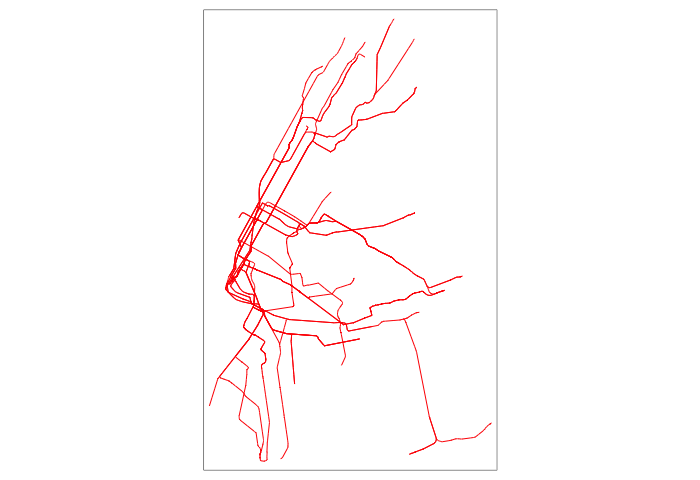

[](https://travis-ci.com/r-gtfs/gtsf)

## Description

`gtsf` is an R package for using GTFS data as [simple
features](https://en.wikipedia.org/wiki/Simple_Features). You can also
use it to make shapefiles and geojson from GTFS data.

## Installation

You can install this package from GitHub using the devtools package:

    if (!require(devtools)) {
        install.packages('devtools')
    }
    devtools::install_github('r-gtfs/gtsf')

## Example Usage

Import transit lines from the NYC Subway using `trread`.

``` r
library(trread)
library(gtsf)
library(dplyr)

NYC <- import_gtfs("http://web.mta.info/developers/data/nyct/subway/google_transit.zip")
#> [1] "agency.txt"         "calendar_dates.txt" "calendar.txt"      
#> [4] "routes.txt"         "shapes.txt"         "stop_times.txt"    
#> [7] "stops.txt"          "transfers.txt"      "trips.txt"
```

## Get Simple Features

``` r
NYC <- gtfs_as_sf(NYC)
```

This adds two simple features dataframes to the list of GTFS objects:
-stops\_sf -routes\_sf

## Make Maps

These can be mapped with various libraries. For example, with the
[tmap](https://cran.r-project.org/web/packages/tmap/vignettes/tmap-nutshell.html)
package:

``` r
library(tmap)
routes_sf <- NYC$sf_routes
qtm(routes_sf)
```



## Export (GeoJSON/Shapefile)

They can also be exported to geojson, for use elsewhere. For example:

``` r
library(sf)
st_write(NYC$sf_routes,"nyc_routes.geojson", delete_dsn = TRUE)
#> Deleting source `nyc_routes.geojson' failed
#> Writing layer `nyc_routes' to data source `nyc_routes.geojson' using driver `GeoJSON'
#> features:       25
#> fields:         1
#> geometry type:  Multi Line String
```
